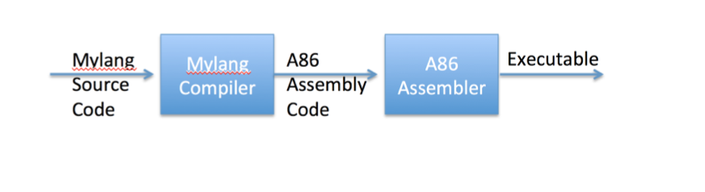

# Simple Compilier converts MyLang to x86 Assembly Language

Boun CmpE230, 2014 Fall, first project.

If there is a conflict between the rules of the grammer and program will warn you and says what is missing or what is wrong.



## MyLang Grammer

*stm*  ⮕   **id =** expr
        | **print** expr
        | **read** id
        | **if** expr **then** stm
        | **while** expr **do** stm
        | **begin** opt_stmts **end**

*opt_stms*  ⮕   *stmt_list*
        | **ε**

*stmt_list*  ⮕   *stm* ; *stmt_list*
        | **stm**

*expr* ⮕ *term* *moreterms*

*moreterms*  ⮕  **+** *term* *moreterms*
        | **-** *term* *moreterms*
        | **ε**


*term*  ⮕  *factor* *morefactors*

*morefactors*  ⮕  * *factor* *morefactors*
        | **/** *factor* *morefactors* 
        | **%** *factor* *morefactors*
        | **ε**


*factor*  ⮕  **(** expr **)**
        | **id**
        | **num**

<br/>
<br/>
<br/>


## Compilier operations

**id** is an identifier (variable) and **num** is an integer.   


| Syntax      | Description |
| :---        |    :---      |   
| + - * / %      | Binary operations: Pop two values from the stack, perform the binary operation and push the result onto the stack.       |
| push-num n   | push number n onto the stack        |
| push-val-var v  | push value of variable v onto the stack      |
| push-addr-var v  | push address of variable v onto the stack    |
| pop   | pop value on top of the stack       |
| assign  | the value on top of stack is placed in the address below it and both are popped from the stack       |
| print   | Print the value on top and then pop the value.      |
| label LABL  |Target of jumps to label LABL, has no other effect (i.e. no operation)       |
| jump LABL   | Unconditional jump to label LABL      |
| jump-if-false LABL   | Pop the value on top of the stack and then jump to label LABL if it is zero    |
| stop   | Stop execution and return to the operating system     |

<br/>
<br/>
<br/>

## Examples

**The program:** <br/>
`val = ( 461*y ) div 4 + ( 200*m+2) div 5 + d` 

is translated to the following instructions: 

| line | Abstract Instruction      | A86 Instuctions |
| :---|    :----:      |   :----: |
|  0   |  push-addr-var val   |  PUSH offset VAL   |
|  1   |  push-num 461   |   PUSH 461  |
|  2   |   push-val-var y  |  PUSH Y   |
|  3   |   *  |   POP CX <br/> POP AX<br/>  MULT CX <br/> PUSH AX  |
|  4   |   push-num 4  |  PUSH 4   |
|  5   |  div   |  MOV DX,0 <br/> POP CX <br/> POP AX <br/> DIV CX <br/>PUSH AX   |
|  6   |  push-num 200   |  PUSH 200   |
|  7   | push-val-var m    |  PUSH M   |
|  8   |   *  |   POP CX <br/> POP AX<br/>  MULT CX <br/> PUSH AX  |
|  9   |  push-num 2   | PUSH 2    |
|  10   |  +   |  POP CX <br/> POP AX <br/> ADD AX,CX <br/> PUSH AX   |
|  11  |   push-num 5  |  PUSH 5   |
|  12  |    div  |   MOV DX,0 <br/> POP CX <br/>  POP AX <br/> DIV CX <br/> PUSH AX  |
|  13   |  +   |  POP CX <br/> POP AX <br/> ADD AX,CX <br/> PUSH AX   |
|  14  |   push-val-var d  |  PUSH D   |
|  15   |  +   |  POP CX <br/> POP AX <br/> ADD AX,CX <br/> PUSH AX   |
|  16  |  assign |  POP AX <br/> POP BX <br/> MOV [BX],AX  |
|  17 |   stop  |  INT 20h  |

<br/>
<br/>
<br/>

**Consider the following if statement:** <br/>
`if expr then stm` 

It will be translated as: 

| line | A86 Instuctions |
| :---|      :----: |
|  0   |   code for expr   |
|  1   | POP AX <br/> JZ OUTLABEL  |
|  2   |    code for stm  |
|  3   |    OUTLABEL NOP  |
<br/>
<br/>
<br/>


**Consider a while loop:** <br/>
`if expr then stm` 

It will be translated as: 

| line | A86 Instuctions |
| :---|      :----: |
|  0   |   TESTLABEL NOP   |
|  1  |   code for expr   |
|  2   | POP AX <br/> JZ OUTLABEL  |
|  3   |    code for stm  |
|  4   |   JMP TESTLABEL  |
|  5   |    OUTLABEL NOP  |

<br/>
<br/>
<br/>


## Building from source

takes an input file as an argument and an output file as an argument 

```bash
java MyLang {inputFilePath} {outputFilePath}
```

## Disclaimer

This is my sophomore project, thus it has not been maintained.

I assumed that before using a variable that has been daclared and there is not any type errors.

